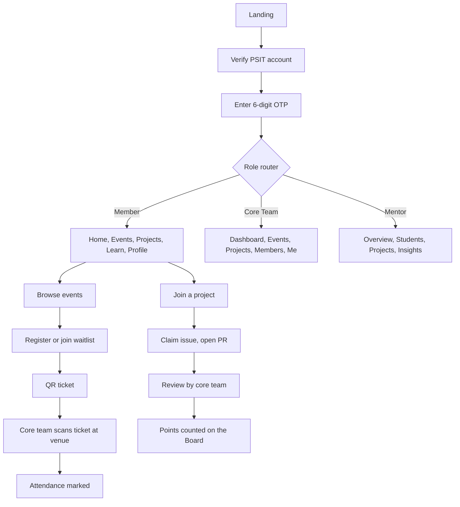

<div align="center">

# 📱 GDGoC PSIT — Mobile App (Flutter)

**The official chapter app for Google Developer Groups on Campus, PSIT.**
Learn. Build. Ship. Earn your place on the Board.


[Design Mockups](#design-mockups) · [Screen Catalog](#screen-catalog) · [Good First Issues](../../issues?q=is%3Aissue+is%3Aopen+label%3A%22good+first+issue%22) · [Report a Bug](../../issues) · [Web Platform](#)

</div>

---

<a id="table-of-contents"></a>

## 📑 Table of Contents

1. [Open Source October](#open-source-october)
2. [TL;DR for Contributors](#tldr-for-contributors)
3. [About the App](#about-the-app)
4. [Roles](#roles)
5. [App Flow](#app-flow)
6. [Screen Catalog](#screen-catalog)
7. [Feature Details](#feature-details)
8. [Business Rules](#business-rules)
9. [Design Mockups](#design-mockups)
10. [Design System](#design-system)
11. [Tech Stack](#tech-stack)
12. [Architecture & Project Structure](#architecture-project-structure)
13. [Navigation](#navigation)
14. [Data Models](#data-models)
15. [API Contract](#api-contract-proposed)
16. [Getting Started](#getting-started)
17. [How to Contribute](#how-to-contribute)
18. [Coding Standards](#coding-standards)
19. [Testing](#testing)
20. [What to Build](#what-to-build)
21. [Known Gaps & Open Questions](#known-gaps-open-questions)
22. [FAQ & Troubleshooting](#faq-troubleshooting)
23. [License](#license)

---

<a id="open-source-october"></a>

## 🎃 Open Source October

This app is **open source and built by students, for students**. During **Open Source October**, GDGoC PSIT's month-long open-source event, we are inviting contributors to build it together.

Every screen in this README already has a finished design. Pick a screen, build it in Flutter, and open a PR.

**How contributions count**

| Item | Detail |
|---|---|
| Event period | October 2026 |
| What counts | PRs that are **merged** and labelled `oso-accepted` by a maintainer |
| What doesn't count | PRs labelled `invalid` or `spam`, unassigned duplicate work, unmerged PRs |
| Points per PR | _To be announced by the organisers_ |
| Recognition | _To be announced by the organisers_ |

> Quality over quantity. One solid, tested screen is worth more than ten tiny edits.

---

<a id="tldr-for-contributors"></a>

## ⚡ TL;DR for Contributors

1. Open [Issues](../../issues) and pick one labelled **`good first issue`** (or any `help wanted`).
2. Comment **"I'd like to work on this"** and wait until a maintainer **assigns** you.
3. Fork → clone → `git checkout -b feat/<short-name>`.
4. Open the [design mockup](#design-mockups) and build the screen to match it, including its states.
5. Run `flutter analyze` and `flutter test` and make sure both pass.
6. Open a PR to `main`, link the issue (`Closes #123`) and attach **screenshots or a screen recording**.

---

<a id="about-the-app"></a>

## 📖 About the App

The GDGoC PSIT app brings the whole chapter into one place. Students verify with their PSIT roll number, discover and register for events, get QR tickets, join open-source projects, follow learning paths, and watch their rank climb on the chapter **Board**. Core team members manage events and review contributions, and mentors get a read-only view of how the chapter is doing.

It is the mobile companion to the GDGoC PSIT web platform and uses the same backend. It is built with **Flutter** from a single codebase: **Android is the primary target** (the mockups are Material 3 designs), and iOS builds are welcome once the Android screens are in place.

**Status:** designs complete (22 screens) · implementation starting · backend shared with the web platform.

---

<a id="roles"></a>

## 👥 Roles

The app routes every user to the right experience after sign-in.

| Role | Bottom navigation | Purpose |
|---|---|---|
| 🎓 **Member** | Home · Events · Projects · Learn · Profile | Take part in the chapter |
| 🛠️ **Core Team** | Dashboard · Events · Projects · Members · Me | Run the chapter |
| 🧭 **Mentor** | Overview · Students · Projects · Insights | Read-only oversight and reports |

A user has exactly one role, returned by the API after verification.

---

<a id="app-flow"></a>

## 🗺️ App Flow



---

<a id="screen-catalog"></a>

## 🧭 Screen Catalog

22 designed screens plus 1 screen that still needs a design (QR scanner). Use this table to pick work. **Difficulty** is a guide for choosing issues.

| # | Screen | Group | Route | States in mockup | Difficulty |
|---|---|---|---|---|---|
| 01 | Landing | Public | `landing` | Scroll top / middle / bottom, Member | 🟡 Medium |
| 02 | Join and verify | Public | `verify` | Default | 🟢 Easy |
| 03 | OTP | Public | `otp` | Default, Verifying | 🟡 Medium |
| 04 | Role router | Public | `role-router` | Member, Core Team, Mentor | 🟢 Easy |
| 05 | Home | Member | `member/home` | Default, Board expanded | 🟡 Medium |
| 06 | Events (card deck) | Member | `member/events` | Deck, Past event | 🔴 Hard |
| 07 | Event detail | Member | `member/events/{id}` | Not registered, Registered, Ticket | 🟡 Medium |
| 08 | Projects | Member | `member/projects` | Default | 🟢 Easy |
| 09 | Project detail | Member | `member/projects/{id}` | Member, Core Team | 🟡 Medium |
| 10 | Learn | Member | `member/learn` | Paths (Resources and Sessions tabs) | 🟡 Medium |
| 11 | Profile | Member | `member/profile` | Own, Mentor view | 🟡 Medium |
| 12 | Dashboard | Core Team | `core/dashboard` | Default, Board expanded | 🟡 Medium |
| 13 | Manage events | Core Team | `core/events` | Default, Live now preview | 🟡 Medium |
| 14 | Review queue | Core Team | `core/projects/{id}/review` | Default | 🟢 Easy |
| 15 | Members | Core Team | `core/members` | Default | 🟢 Easy |
| 16 | Me | Core Team | `core/me` | Default | 🟢 Easy |
| 17 | Overview | Mentor | `mentor/overview` | Default, Board expanded, Export sheet | 🟡 Medium |
| 18 | Students | Mentor | `mentor/students` | Active contributors, All students | 🟡 Medium |
| 19 | Insights | Mentor | `mentor/insights` | Default, Export sheet | 🔴 Hard |
| 20 | Loading | Shared | n/a (component) | Skeleton cards | 🟢 Easy |
| 21 | Empty | Shared | n/a (component) | Board with no contributions | 🟢 Easy |
| 22 | Error | Shared | n/a (component) | Default, Retrying, Loaded | 🟢 Easy |
| 23 | **QR scanner** ⚠️ | Core Team | `core/events/{id}/scan` | **No mockup yet** | 🔴 Hard |

> Routes are proposals to keep naming consistent. If you think one should change, raise it in the issue before building.

---

<a id="feature-details"></a>

## ✨ Feature Details

### 🔐 Sign-in & Verification (screens 01 to 04)
- **Landing:** logo, "GDG on Campus PSIT" hero, live stats (students, projects, merged PRs), what the chapter is (Learn, Build, Ship), a four-step "How to get involved", a "Coming up" event card, an auto-scrolling **activity feed** ("Ishita Verma merged a PR · 2m"), and social links (GitHub, Instagram, X, LinkedIn, Discord, YouTube). A sticky **Join the chapter** button appears while scrolling, and changes to the member's name chip and **Open the app** once signed in.
- **Join and verify:** roll number field and the Gmail address linked to the PSIT record. The Gmail field shows a hint: "Use the @gmail.com address linked to your PSIT record". Primary action: **Send verification code**. Terms and privacy note below.
- **OTP:** six single-digit boxes, an auto-focus on the active box, a resend countdown, a **Verifying** state with a loading indicator and the message "Checking your roll number against PSIT records", and a "Wrong email? Go back" action.
- **Role router:** a success confirmation ("You're in, Aarav") with the role line, for example "Member · Computer Science, 3rd year", then **Enter the app**.

### 🏠 Home — Member (screen 05)
- Greeting ("Good morning, Aarav")
- **Board card:** your rank (for example #14), your points, top three, expandable to the full list, with filter chips for Events, Learning and PRs. The row for the signed-in user is highlighted.
- **Events** strip with the next event as a large poster and two smaller ones, plus "See all"
- **Projects** shortcuts
- **Activity** grid of recent chapter updates

### 🎟️ Events (screens 06 and 07)
- **Filters:** All, Open, Registered, Waitlist, Past
- **Card deck:** one large card at a time with the next ones peeking behind. Swipe left or right (with rotation and spring release), chevron buttons, dot indicators, and an "n of N" counter
- **Card content:** poster with icon and title, date and time, venue, seats ("147 of 150 registered"), status chip, and **View details**
- **Past events** show "Attended" and "you attended"
- **Detail:** horizontally scrolling gallery, title, date/time/venue chips, seats chip, About, Speakers, "What you'll learn"
- **Bottom action bar** (glass style): **Register**, or **View ticket** once registered, plus Add to calendar and Share
- **Ticket sheet:** "You're registered" confirmation, QR code, name, roll number and ticket ID, **Save ticket** and **Add to calendar**

### 🧩 Projects (screens 08 and 09)
- **Filters:** All, Web, Android, Docs
- **Card:** icon tile, name, tech stack, `open issues · merged PRs · contributors`, and a **Joined** chip
- **Detail:** animated gradient mesh header, three stat cards (open issues, merged PRs, contributors), **Getting started** (join the project, set up your repo, claim a beginner issue), **Open issues** with number, title, difficulty chip and assignee avatars
- **Member** action: **Join project**. **Core Team** sees an **Awaiting review** section and **Open review queue**

### 🎓 Learn (screen 10)
- Tabs: Paths, Resources, Sessions
- Learning paths with progress bars (`6 of 10 modules · 24 hours`) and **Continue** or **Start**
- Paths: Android with Kotlin, Web with Next.js, ML with TensorFlow, Cloud with GCP, Flutter Cross-Platform
- **Past sessions** list with recordings (title, type, date, duration)

### 👤 Profile (screen 11)
- Avatar, name, roll number, GitHub handle, **Edit profile** (own) or **Mentor view** with **View on GitHub**
- Stats: merged PRs, open PRs, Board rank
- Badges (for example **First PR**, **Event Regular**) and skill chips
- **Contribution timeline:** claimed an issue, PR opened, changes requested, counted on the Board
- Own profile only: current ticket, notifications, privacy ("Profile visible to mentors"), sign out

### 🛠️ Core Team (screens 12 to 16)
- **Dashboard:** four KPI cards (upcoming events, registered students, projects, merged PRs), **Needs your attention** (PRs awaiting review, events nearly full, open waitlists), the Board, a Team summary, and a **New** floating action button
- **Manage events:** Upcoming and Past toggle, per-event registration progress bar (`147 / 150 registered`), edit action, **Live now** state, **New event** FAB
- **Review queue:** open PRs per project with author, title and `+additions -deletions`, each with a **Review** button
- **Members:** filter chips (Active, All roles, Department), verified member count, rows with roll number, department chip and points
- **Me:** profile with role chip (for example Organizer), chapter settings, notifications, privacy, sign out

### 🧭 Mentor (screens 17 to 19)
- **Overview:** KPI cards (students, active contributors, upcoming events, average merges), **Department participation** bars, the Board, **Export report** (PDF or CSV)
- **Students:** toggle between **Active contributors** and **All students**, with counts ("61 active of 214") and merges per student
- **Insights:** engagement rate with a growth line chart, **Skills across members** bars (Web, Android, ML, Cloud), **Project momentum**, export

### ⚙️ Shared states (screens 20 to 22)
- **Loading:** pulsing skeleton cards
- **Empty:** "No contributions yet" with a Browse projects action
- **Error:** "Couldn't load events" with Retry, a retrying indicator, and the loaded result

### 🎫 Attendance scanning (screen 23, needs design)
The web platform lets organisers scan a ticket QR to mark attendance, and the app must do the same for Core Team. There is **no mockup yet**. The expected behaviour is:
- Core Team opens an event from **Manage events** and taps **Scan tickets**
- Camera view with a scan frame; on a valid ticket, show the member's name, roll number and a success state
- Already-used or invalid tickets show a clear error
- Each ticket can mark attendance **once**

Designers and contributors: please propose the screen in the issue before building.

---

<a id="business-rules"></a>

## 📐 Business Rules

Rules inferred from the mockups. If the backend says otherwise, the backend wins; raise it in the issue.

| Area | Rule |
|---|---|
| Roll number | 13 digits (example `2501640100567`) |
| Email | Must be the `@gmail.com` address linked to the PSIT record |
| OTP | 6 digits, with a resend timer (mockup shows `0:24`) |
| Verification | The roll number is matched against PSIT records after the OTP |
| Role | One of Member, Core Team, Mentor; decides the navigation graph |
| Ticket ID | `<EVENT-CODE>-<last 4 of roll>` style, for example `OSO26-KICK-0567` |
| Event status (for a member) | `Open`, `Registered`, `Waitlist`, `Attended` |
| Capacity | Events show `registered of capacity`; when full, registration becomes a waitlist |
| Ticket | One per member per event; QR can mark attendance once |
| Issue difficulty | `Beginner`, `Intermediate`, `Advanced` |
| Board | Ranks members by points; can be filtered by Events, Learning and PRs |
| Points | The mockup uses a mock weighting. **Real weighting is undecided** |
| Mentor visibility | Mentors can see active contributors; profiles are visible to mentors |

---

<a id="design-mockups"></a>

## 🖼️ Design Mockups

All 22 screens are designed in one interactive HTML file: [`design/gdgoc-chapter-app-mockups.html`](design/gdgoc-chapter-app-mockups.html).

### 🔗 How to open the mockups

GitHub shows `.html` files as source code, so clicking the file in the repo will **not** open the design. Use one of these instead:

| Option | How |
|---|---|
| **Live preview (recommended)** | [Open the hosted mockups (replace ORG and REPO)](https://ORG.github.io/REPO/design/gdgoc-chapter-app-mockups.html). _Maintainers: enable GitHub Pages (Settings → Pages → deploy from `main`) so this link works._ |
| **Quick preview** | Paste the raw file URL into [htmlpreview.github.io](https://htmlpreview.github.io/) |
| **Local** | Clone the repo and double-click `design/gdgoc-chapter-app-mockups.html`, or run `open design/gdgoc-chapter-app-mockups.html` (macOS) / `start design\gdgoc-chapter-app-mockups.html` (Windows) |

The mockups load fonts and icons from Google Fonts, so open them while online.

### 🕹️ Using the mockups

- **Grid view** shows all screens; **Solo view** shows one at a time (arrow keys to move, `R` to replay motion, `Esc` to go back)
- **State chips** under each screen switch between its states (for example Not registered → Registered → Ticket)
- **Replay motion** shows the entrance animations

> ⚠️ The mockups are marked **draft for lead review, not for production**, and use **synthetic data** (names, roll numbers, points, events). Never hard-code that data in the app; use the API or a clearly marked fake data source.

---

<a id="design-system"></a>

## 🎨 Design System

Material 3, with Google's four brand colours. Create these as tokens in `core/designsystem`. **Never hard-code colours or sizes in screens.**

### Colour tokens

| Token | Value | Use |
|---|---|---|
| `canvas` | `#F8F9FA` | App background |
| `surface` | `#FFFFFF` | Cards, sheets |
| `surfaceAlt` | `#F1F3F4` | Skeletons, subtle fills |
| `outline` | `#DADCE0` | Card borders, dividers |
| `onSurface` | `#202124` | Primary text |
| `onSurface2` | `#5F6368` | Secondary text |
| `onSurface3` | `#80868B` | Tertiary text |
| `primary` | `#1A73E8` | Primary actions |
| `primaryPress` | `#1967D2` | Pressed state |
| `brandBlue` | `#4285F4` | Brand |
| `brandRed` | `#EA4335` | Brand |
| `brandYellow` | `#FBBC04` | Brand |
| `brandGreen` | `#34A853` | Brand |
| `tintBlue` / `Red` / `Yellow` / `Green` | `#E8F0FE` / `#FCE8E6` / `#FEF7E0` / `#E6F4EA` | Chip and card tints |
| `onTintBlue` / `Green` / `Red` / `Amber` | `#174EA6` / `#137333` / `#B31412` / `#7A4700` | Text on tints (check contrast) |

State layers: hover `0.08`, focus `0.10`, press `0.10`, drag `0.16`.

### Typography
- **Display and titles:** Google Sans (Flex)
- **Body and labels:** Roboto
- **Numbers, IDs, roll numbers:** Roboto Mono

| Style | Size / line height |
|---|---|
| Display M / S | 45/52 · 36/44 |
| Headline M / S | 28/36 · 24/32 |
| Title L | 22/28 |
| Title M / S | 16/24 · 14/20 (weight 500) |
| Body L / M / S | 16/24 · 14/20 · 12/16 |

### Shape and spacing
- **Corner radius:** 4 · 8 · 12 · 16 · 20 · 28 · 32 · 48 dp, and full (pill)
- **Spacing scale:** 4 · 8 · 12 · 16 · 20 · 24 · 32 · 40 · 48 dp (page padding 20 dp)
- **Minimum touch target:** 48 dp
- **Elevation:** three levels, using the Material card shadows

### Motion
Springs are defined with a damping ratio and a stiffness (mass is always 1). In Flutter, build them with `SpringDescription.withDampingRatio` and drive an `AnimationController` with a `SpringSimulation`:

| Token | Damping ratio | Stiffness | Use |
|---|---|---|---|
| `spatial-fast` | 0.6 | 800 | Small, snappy movement |
| `spatial-default` | 0.8 | 380 | Standard movement (card deck release, scrolling) |
| `spatial-slow` | 0.8 | 200 | Large entrances, success pop-in |
| `effects-fast` | 1.0 | 3800 | Quick fades |
| `effects-default` | 1.0 | 1600 | Standard fades |
| `effects-slow` | 1.0 | 800 | Slow fades |

```dart
// core/theme/motion.dart
const spatialDefault = SpringDescription.withDampingRatio(
  mass: 1, stiffness: 380, ratio: 0.8,
);
// controller.animateWith(SpringSimulation(spatialDefault, 0, 1, velocity));
```

- Screens enter with **staggered** animations (first six items offset)
- The event deck uses swipe with rotation and a spring settle
- Loader is a morphing shape; skeletons pulse
- **Reduced motion:** when `MediaQuery.of(context).disableAnimations` is true, skip springs and show final states immediately

### Shared components to build first
Top app bar · Bottom navigation bar · Assist chip · Filter chip · Button group · Filled / outlined / text buttons · Floating action button · Outlined card (with tinted variants) · List item · Avatar (colour from four-colour cycle, initials) · Linear progress · Poster / tile (two-colour gradient + icon) · Bottom sheet · Skeleton · Empty state · Error state · KPI card · Board card

### Accessibility
- `Semantics` labels on all icon-only buttons and the ticket QR
- 48 dp touch targets
- Text contrast: verify the "on tint" colours meet WCAG AA
- Support text scaling (`MediaQuery.textScalerOf`) and TalkBack
- Respect reduced-motion

---

<a id="tech-stack"></a>

## 🧰 Tech Stack

| Layer | Technology |
|---|---|
| **Framework** | Flutter (stable channel), Dart 3 |
| **UI** | Material 3 (`useMaterial3: true`) with a custom `ThemeExtension` for the design tokens |
| **State management** | Riverpod (`flutter_riverpod`, `riverpod_generator`) |
| **Navigation** | `go_router` with a `StatefulShellRoute` per role |
| **Networking** | `dio` with interceptors for auth and error mapping |
| **Models** | `freezed` + `json_serializable` |
| **Local storage** | `flutter_secure_storage` (tokens), `shared_preferences` (settings), `drift` for the offline cache |
| **Images** | `cached_network_image` |
| **QR** | `qr_flutter` (generate tickets), `mobile_scanner` (scan tickets) |
| **Charts** | `fl_chart` |
| **Fonts** | `google_fonts` |
| **Localisation** | `flutter_localizations` + ARB files (`flutter gen-l10n`) |
| **Notifications** | `firebase_messaging`, `flutter_local_notifications` |
| **Share / calendar** | `share_plus`, `add_2_calendar` |
| **Reports** | `pdf` + `printing`, `csv` (decide in the export issue) |
| **Testing** | `flutter_test`, `mocktail`, golden tests, `integration_test` |
| **Lints** | `flutter_lints` (or `very_good_analysis`) |
| **CI** | GitHub Actions: format, analyze, test |
| **Backend** | GDGoC PSIT API (Node.js, Express, MongoDB) |

> This is the proposed stack. Suggest changes in an issue **before** starting, and get a maintainer's approval before adding any new package.
---

<a id="architecture-project-structure"></a>

## 🏗️ Architecture & Project Structure

```
gdgoc-psit-app/
├── lib/
│   ├── main.dart
│   ├── app.dart                     # MaterialApp.router, theme, locale
│   ├── core/
│   │   ├── theme/                   # colour, typography, shape, spacing, motion tokens
│   │   ├── widgets/                 # shared components (chips, cards, avatars, nav bars, states)
│   │   ├── network/                 # dio client, interceptors, API exceptions
│   │   ├── data/                    # local storage, drift database
│   │   ├── router/                  # go_router config, route guards, role shells
│   │   └── utils/
│   └── features/
│       ├── auth/                    # landing, verify, otp, role router
│       ├── home/                    # home, board
│       ├── events/                  # deck, detail, ticket, manage events, scanner
│       ├── projects/                # list, detail, review queue
│       ├── learn/                   # paths, resources, sessions
│       ├── profile/                 # profile, badges, timeline, settings
│       ├── members/                 # core team member list
│       └── insights/                # mentor overview, students, insights, export
│           └── (each feature has data/, domain/, presentation/)
├── test/                            # unit, widget and golden tests
├── integration_test/
├── assets/                          # images, icons
├── l10n/                            # ARB files
├── design/
│   └── gdgoc-chapter-app-mockups.html
├── android/   ios/
├── env.example.json                 # copy to env.json (git-ignored)
└── pubspec.yaml
```

**Conventions**
- Each feature is split into `data/` (DTOs, repository implementation), `domain/` (models, repository interface) and `presentation/` (screens, widgets, providers)
- Each screen is driven by one provider that exposes an `AsyncValue` state (`loading`, `data`, `error`) and an explicit **empty** state
- Widgets are **small and stateless where possible**; business logic lives in providers and repositories, never inside `build()`
- Repositories are interfaces with a real and a fake implementation, so UI can be built without the backend
- Every screen has a widget test and a golden test for each state shown in the mockup
---

<a id="navigation"></a>

## 🧭 Navigation

- `landing` → `verify` → `otp` → `role-router`
- `go_router` redirects by auth state and role, then opens one of three shells: `member`, `core` or `mentor`
- Each shell is a `StatefulShellRoute.indexedStack`, giving every role its own bottom navigation bar and a preserved back stack per tab
- Deep links (planned): `gdgocpsit://events/{id}` for event links and shared tickets
- Signed-in users skip straight to their role's shell on launch (token in secure storage)
---

<a id="data-models"></a>

## 🗃️ Data Models

Starting point in Dart with `freezed`. Final shapes come from the API; keep DTOs (in `data/`) and domain models (in `domain/`) separate.

```dart
enum Role { member, coreTeam, mentor }

@freezed
class User with _$User {
  const factory User({
    required String id,
    required String name,
    required String rollNumber,        // 13 digits
    required String email,             // @gmail.com linked to PSIT record
    required Role role,
    required String department,        // e.g. "Computer Science"
    required int year,
    String? githubHandle,
    required int points,
    int? rank,
  }) = _User;
}

enum RegistrationStatus { open, registered, waitlist, attended }

@freezed
class Event with _$Event {
  const factory Event({
    required String id,
    required String title,
    required DateTime startsAt,
    required String venue,
    required int capacity,
    required int registered,
    required String about,
    required List<Speaker> speakers,
    required List<String> learnings,
    required RegistrationStatus myStatus,
    required bool isLive,
  }) = _Event;
}

@freezed
class Ticket with _$Ticket {
  const factory Ticket({
    required String ticketId,          // e.g. OSO26-KICK-0567
    required String eventId,
    required String qrPayload,
    required bool attended,
  }) = _Ticket;
}

enum ProjectCategory { web, android, docs }

@freezed
class Project with _$Project {
  const factory Project({
    required String id,
    required String name,
    required List<String> stack,
    required ProjectCategory category,
    required int openIssues,
    required int mergedPrs,
    required int contributors,
    required bool joined,
  }) = _Project;
}

enum Difficulty { beginner, intermediate, advanced }

@freezed
class Issue with _$Issue {
  const factory Issue({
    required int number,
    required String title,
    required Difficulty difficulty,
    required List<User> assignees,
  }) = _Issue;
}

@freezed
class PullRequest with _$PullRequest {
  const factory PullRequest({
    required String title,
    required User author,
    required int additions,
    required int deletions,
  }) = _PullRequest;
}

@freezed
class BoardEntry with _$BoardEntry {
  const factory BoardEntry({required User user, required int points, required int rank}) = _BoardEntry;
}

@freezed
class LearningPath with _$LearningPath {
  const factory LearningPath({
    required String id,
    required String title,
    required int completedModules,
    required int totalModules,
    required int hours,
  }) = _LearningPath;
}

@freezed
class Badge with _$Badge {
  const factory Badge({required String id, required String label}) = _Badge;
}

@freezed
class TimelineItem with _$TimelineItem {
  const factory TimelineItem({required String title, required String detail, required DateTime date}) = _TimelineItem;
}
```
---

<a id="api-contract-proposed"></a>

## 🔌 API Contract (proposed)

Base URL comes from `API_BASE_URL`. All requests except auth use `Authorization: Bearer <token>`. These endpoints are a **proposal** to align with the web backend; the backend team will confirm.

| Method | Endpoint | Description | Roles |
|---|---|---|---|
| POST | `/auth/verify` | Send OTP for roll number and Gmail | Public |
| POST | `/auth/otp` | Verify OTP, return token, user and role | Public |
| GET | `/me` | Current user | All |
| GET | `/board?filter=events\|learning\|prs` | Board entries and my rank | All |
| GET | `/events?status=` | List events | All |
| GET | `/events/{id}` | Event detail | All |
| POST | `/events` · PUT `/events/{id}` | Create or edit event | Core Team |
| POST | `/events/{id}/register` | Register or join waitlist, return ticket | Member |
| GET | `/tickets/me` | My tickets | Member |
| POST | `/attendance/scan` | Validate QR and mark attendance (once) | Core Team |
| GET | `/projects?category=` | List projects | All |
| GET | `/projects/{id}` | Project detail, stats, issues | All |
| POST | `/projects/{id}/join` | Join a project | Member |
| GET | `/projects/{id}/reviews` | PRs awaiting review | Core Team |
| GET | `/learn/paths` · `/learn/sessions` | Learning paths and past sessions | Member |
| GET | `/members` | Verified members | Core Team |
| GET | `/students?active=` | Students list | Mentor |
| GET | `/insights` · `/overview` | Charts and KPIs | Mentor |
| GET | `/reports?format=pdf\|csv` | Export report | Mentor |
| GET | `/activity` | Recent chapter activity | All |

---

<a id="getting-started"></a>

## ⚙️ Getting Started

### Prerequisites
- [Flutter SDK](https://docs.flutter.dev/get-started/install) (stable channel; the supported version range is in `pubspec.yaml`)
- Android Studio or VS Code with the Flutter and Dart extensions
- Android SDK and an emulator or a physical device with USB debugging
- Git
- (For iOS work) a Mac with Xcode

Run `flutter doctor` and fix anything it reports before you start.

### Setup
```bash
git clone https://github.com/<your-username>/gdgoc-psit-app.git
cd gdgoc-psit-app
git remote add upstream https://github.com/<org>/gdgoc-psit-app.git

flutter pub get
dart run build_runner build --delete-conflicting-outputs   # generates freezed / json / riverpod code
```

### Configuration
Create `env.json` from `env.example.json` (it is git-ignored, **never commit it**):
```json
{
  "API_BASE_URL": "http://10.0.2.2:5000/api/"
}
```
`10.0.2.2` is the Android emulator's address for your computer's `localhost` (on the iOS simulator use `http://127.0.0.1:5000/api/`).

Run the app:
```bash
flutter run --dart-define-from-file=env.json
```

> **No backend yet?** Build the screen against a fake repository with clearly marked sample data (for example `FakeEventsRepository`) behind the repository interface, so it can be swapped for the real one.

### Commands
```bash
flutter run --dart-define-from-file=env.json   # run the app
dart format .                                   # format
flutter analyze                                 # static analysis
flutter test                                    # unit + widget + golden tests
flutter test integration_test                   # integration tests (needs emulator)
flutter build apk --debug                       # debug APK
dart run build_runner watch --delete-conflicting-outputs   # regenerate code while developing
flutter gen-l10n                                # regenerate localisation files
```

### Firebase (only for notification work)
Add your own `google-services.json` to `android/app/` (never commit it). Most features don't need Firebase.

### Keep your fork in sync
```bash
git fetch upstream
git checkout main
git merge upstream/main
```
---

<a id="how-to-contribute"></a>

## 🤝 How to Contribute

### Step by step
1. **Pick an issue** from [Issues](../../issues). Start with `good first issue`, or choose a screen from the [Screen Catalog](#screen-catalog) and open an issue for it.
2. **Claim it.** Comment "I'd like to work on this". Wait until a maintainer assigns it. One person per issue, and please don't start unassigned work.
3. **Fork and clone** the repo, add the upstream remote.
4. **Create a branch** from an up-to-date `main`.
5. **Build to the mockup**, including the states listed in the Screen Catalog (loading, empty and error where relevant).
6. **Test**, run `flutter analyze`, and check light theme on a small and a large screen size.
7. **Commit** using Conventional Commits.
8. **Open a PR** to `main`, link the issue and attach screenshots or a short screen recording.
9. **Respond to review** within a few days. Stale PRs may be closed and the issue reassigned.

### Branch names
`feat/events-deck` · `fix/otp-focus` · `docs/readme-setup` · `style/board-card` · `test/event-controller`

### Commit messages
[Conventional Commits](https://www.conventionalcommits.org/):
```
feat: add swipeable event deck
fix: keep OTP focus after delete
docs: add emulator setup steps
test: cover ticket controller
```
Prefixes: `feat`, `fix`, `docs`, `style`, `refactor`, `test`, `chore`.

### Definition of done
A PR is ready for review when it:
- [ ] Matches the mockup (layout, spacing, colour, type) for every state listed in the catalog
- [ ] Uses design-system tokens and shared components; no hard-coded colours, sizes or strings
- [ ] Strings are in the ARB files
- [ ] Works on small phones and large phones; text scales without clipping
- [ ] Has `Semantics` labels and 48 dp touch targets
- [ ] Respects reduced motion
- [ ] Has unit tests for provider logic and widget or golden tests for each state
- [ ] `dart format`, `flutter analyze` and `flutter test` pass
- [ ] No secrets, `env.json` or `google-services.json` committed, and no unrelated generated files
- [ ] PR description explains what and why, and includes screenshots or a recording

### Rules
- ✅ One PR per issue; keep PRs focused and reviewable
- ✅ Be respectful and follow the Code of Conduct
- ✅ If you use AI tools, review and understand everything you submit
- ❌ No spam PRs (whitespace edits, trivial README changes made only to get a PR count)
- ❌ No copy-pasted code you can't explain
- ❌ No unrelated changes bundled together
- ❌ No committing secrets, keystores or generated build files

Low-quality or spam PRs are labelled `invalid` / `spam`, closed, and **do not count** for Open Source October.

### Labels

| Label | Meaning |
|---|---|
| `good first issue` | Small, well-scoped, beginner friendly |
| `help wanted` | Open for anyone to claim |
| `level: easy` / `medium` / `hard` | Difficulty |
| `design` | Needs design input or a mockup |
| `bug` · `enhancement` · `docs` | Type of work |
| `open-source-october` | Part of the event |
| `oso-accepted` | Merged PR counted for Open Source October |
| `invalid` · `spam` | Not accepted |

### Review process
1. A maintainer checks scope, design match and the checklist
2. Requested changes are listed in the review; push fixes to the same branch
3. Once approved, the PR is merged and labelled `oso-accepted`

---

<a id="coding-standards"></a>

## 📏 Coding Standards

- **Dart style:** follow [Effective Dart](https://dart.dev/effective-dart); run `dart format .` before every commit
- **Widgets:** keep them small, mark constructors `const` where possible, split large `build()` methods into widgets (not helper methods)
- **State:** business logic in Riverpod providers or notifiers, not in widgets; no `setState` for shared or async state
- **Theme:** read colours, text styles, spacing and shapes from `Theme.of(context)` and the `GdgTokens` theme extension. **No hard-coded colours, sizes or font names**
- **Strings:** all user-facing text goes in ARB files (`l10n/`), never hard-coded
- **Naming:** `EventsScreen`, `EventsController`, `EventCard`, `events_repository.dart`
- **Files:** `snake_case.dart`, one main public class per file
- **Generated code:** never edit `*.g.dart` or `*.freezed.dart`; do not commit them if the repo ignores them (check `.gitignore`)
- **Dependencies:** adding a package needs a maintainer's approval in the issue first
- **Comments:** explain why, not what
---

<a id="testing"></a>

## 🧪 Testing

| Type | Tools | What to cover |
|---|---|---|
| Unit | `flutter_test`, `mocktail` | Providers, repositories, mappers, validators (roll number, OTP) |
| Widget | `flutter_test` | Screen states, filter chips, registration flow |
| Golden | `flutter_test` goldens | Every state in the mockup, light theme |
| Integration | `integration_test` | Sign-in flow, register for an event, view ticket |
---

<a id="what-to-build"></a>

## 🛠️ What to Build

Open or ask for an issue for any item below.

### 🟢 Easy
- [ ] Flutter project skeleton: folders, lints, CI workflow, `env.example.json`
- [ ] Design tokens as a `ThemeExtension`: colour, typography, shape, spacing, motion
- [ ] Shared components: chips, avatars, progress, cards, buttons, list item
- [ ] Bottom navigation bars for all three roles
- [ ] Loading, empty and error components (screens 20 to 22)
- [ ] Verify screen and role router (screens 02 and 04)
- [ ] Projects list and Review queue (screens 08 and 14)
- [ ] Members and Me (screens 15 and 16)
- [ ] App icon, native splash screen, ARB string extraction

### 🟡 Medium
- [ ] Landing with activity feed (01)
- [ ] OTP with resend timer and verifying state (03)
- [ ] Home and Board card with expand and filters (05)
- [ ] Event detail with registration states and ticket sheet (07)
- [ ] Project detail with issues and role-based actions (09)
- [ ] Learn paths, resources, sessions (10)
- [ ] Profile with badges and timeline (11)
- [ ] Dashboard (12) and Manage events (13)
- [ ] Mentor Overview and Students (17 and 18)

### 🔴 Hard
- [ ] Swipeable **event card deck** with spring physics (06)
- [ ] Auth: PSIT verification, OTP, secure token storage, `go_router` role guards and shells
- [ ] Registration, waitlist and **QR ticket** generation
- [ ] **QR scanner** for attendance, with design (23)
- [ ] Insights with charts and PDF / CSV export (19)
- [ ] Offline caching with Drift
- [ ] Push notifications for event reminders
- [ ] CI pipeline running lint and tests on each PR

### 🚀 Stretch goals
- [ ] iOS build and platform polish
- [ ] Dark theme
- [ ] Tablet and foldable layouts
- [ ] Add-to-calendar integration
- [ ] Localisation (Hindi)
- [ ] Performance profiling and startup optimisation (Flutter DevTools)

---

<a id="known-gaps-open-questions"></a>

## ❓ Known Gaps & Open Questions

These need a decision from organisers or designers. Comment on the relevant issue if you can help.

1. **QR scanner screen** has no mockup (screen 23)
2. **Points weighting** for the Board is mock data; real rules are undecided
3. **Dark theme and tablet layouts** are not designed
4. **Landing "Member" state** shows a sticky name chip; confirm behaviour when signed out on launch
5. **Learn: Resources tab** is listed in the mockup but only Paths and past Sessions are drawn
6. **Charts:** Insights growth chart is drawn as a simple line; `fl_chart` is proposed, the final choice is open
7. **Export report:** PDF and CSV are shown in a sheet; the server or the device generates them is undecided
8. **Notification settings and Privacy** screens are referenced but not drawn
9. **Event creation / edit form** for Core Team is referenced (New event, edit) but not drawn
10. **State management** (Riverpod) and the package list above are proposals; raise objections in an issue
11. **iOS:** the designs are Material 3 for Android; decide whether iOS gets adaptive tweaks

---

<a id="faq-troubleshooting"></a>

## 🩺 FAQ & Troubleshooting

**Can I work on something that isn't assigned?**
Please don't. Ask to be assigned first so two people don't build the same thing.

**Do I need the backend running?**
Not for UI work. Use a fake repository behind an interface. For integration work, set `API_BASE_URL` in `env.json` to the dev server or a local backend.

**The emulator can't reach my local server.**
Use `http://10.0.2.2:<port>` instead of `localhost` on the Android emulator (`http://127.0.0.1:<port>` on the iOS simulator). For a physical device, use your computer's LAN IP, and allow cleartext HTTP in a debug-only config.

**`flutter doctor` shows problems.**
Fix them in order: SDK path, Android licenses (`flutter doctor --android-licenses`), then emulator or device.

**Generated files are missing or out of date (`*.g.dart`, `*.freezed.dart`).**
Run `dart run build_runner build --delete-conflicting-outputs`.

**Golden tests fail on my machine.**
Goldens can differ across platforms and Flutter versions. Use the same Flutter version as the project, and ask in the PR if only pixel-level noise differs.

**Fonts look different from the mockup.**
The mockup uses Google Sans Flex, Google Sans, Roboto and Roboto Mono. Load them with the `google_fonts` package through the theme (one place only). If a font isn't available, fall back to Roboto.

**My screen differs from the mockup slightly. Is that OK?**
Small deviations need a reason in the PR description. Spacing, colour and type should come from tokens.

**I found a design problem.**
Open an issue with the `design` label and a screenshot.
---

<a id="license"></a>

## 📄 License

Distributed under the MIT License. See [`LICENSE`](LICENSE) for details.

---

<div align="center">

**Made by students, for students.** 🌱
Google Developer Groups on Campus · PSIT

⭐ Star the repo and happy contributing this Open Source October! 🎃

</div>